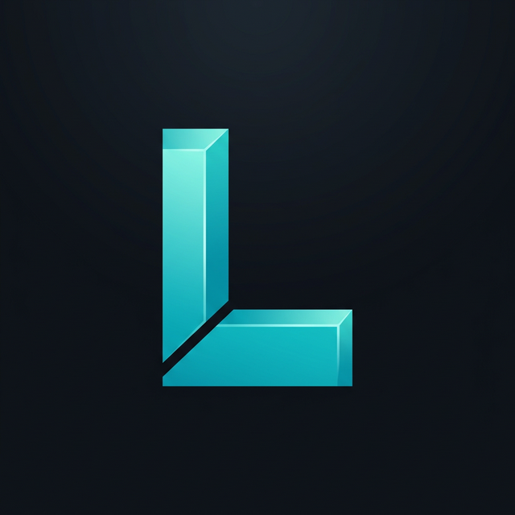

<!-- Banner Image -->

 

<!-- Typing SVG -->

<!-- Animated wave divider -->

<!-- Badges -->

 

## About Me

> Frontend Developer with strong knowledge of **JavaScript** and **React.js**, along with working experience in **Node.js** and **Express.js**. Focused on clean code, responsive design, and performance.

- Apprentice at **Xcelevate Skills Foundation**, Chennai
- Currently learning **Full-Stack MERN Development**
- Full Stack Web Dev — **NavGurukul Foundation**, HP
- **[lokesh.2547@xcelevate.org](mailto:lokesh.2547@xcelevate.org)**
- **[My Portfolio](https://lokesh-three-lyart.vercel.app/)**
- Fun fact: I love building **UI clones & AI tools**

 

---

## Tech Stack

---

## Projects

| Project | Repo | Stack |
|:--------|:----:|:------|
| Holiday Packages App | [View](https://github.com/lokesh123d) | MERN Stack |
| E-Commerce Store | [View](https://github.com/lokesh123d) | MERN Stack |
| Transportation App | [View](https://github.com/lokesh123d) | MERN + GSAP |
| Freelance Client Work | [View](https://github.com/lokesh123d) | React / Static |

---

## GitHub Stats

<!-- Using github-readme-stats alternative instance -->

 

---

## Top Repos

&nbsp;

---

## Connect With Me

&nbsp;&nbsp;

&nbsp;&nbsp;

&nbsp;&nbsp;

&nbsp;&nbsp;

&nbsp;&nbsp;

---

<!-- Snake Contribution Graph -->
<picture>
  <source media="(prefers-color-scheme: dark)" srcset="https://raw.githubusercontent.com/lokesh123d/lokesh123d/output/github-snake-dark.svg" />
  <source media="(prefers-color-scheme: light)" srcset="https://raw.githubusercontent.com/lokesh123d/lokesh123d/output/github-snake.svg" />
  
</picture>

 

<!-- Pac-Man animation -->

 

If you like my work, consider starring my repos!

 

<!-- Footer wave -->

